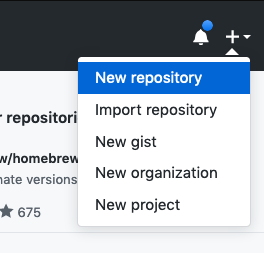
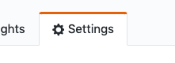
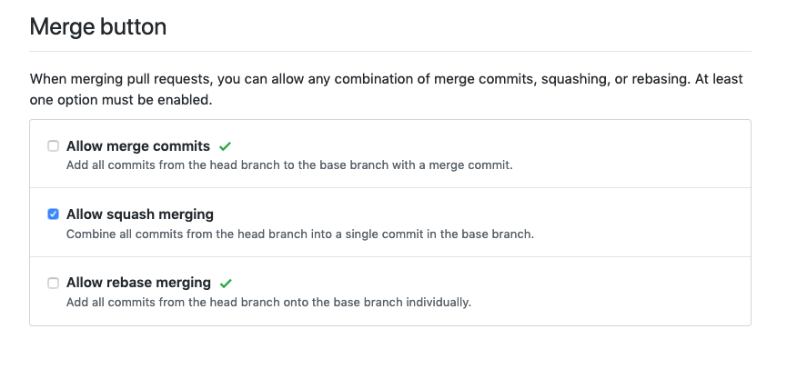
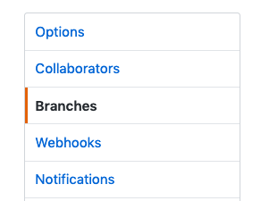
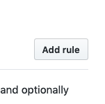
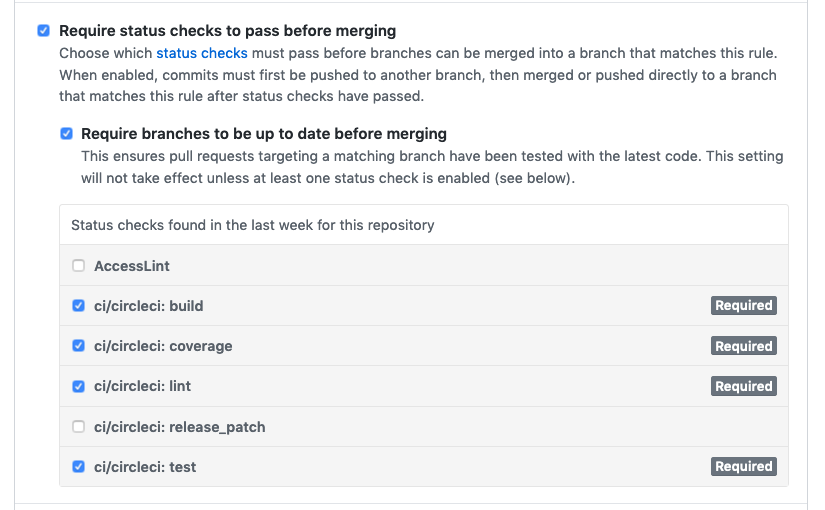
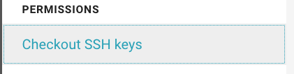
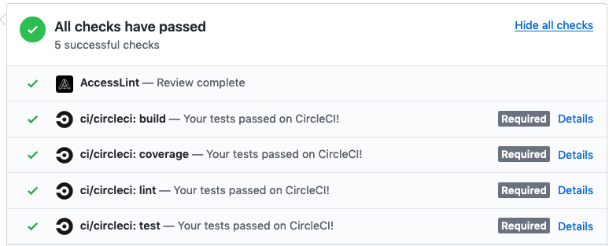

# @daniellacosse/generator-typescript

[](https://badge.fury.io/js/%40daniellacosse2Fgenerator-typescript)

## installation

> before you get started, you'll need to install `homebrew`: [ [mac](https://brew.sh/) | [linux](https://docs.brew.sh/Homebrew-on-Linux) ]

```bash
brew install yarn
yarn global add yo @daniellacosse/generator-typescript
```

## creating a project

feel free to add this to your `~/.bash_profile` or just run the commands manually:

```sh
dts() {
  read $MY_PROJECT_NAME

  # the terminal will wait for you to type in the name of your project. please use `pascal-case`

  mkdir $MY_PROJECT_NAME
  cd $MY_PROJECT_NAME

  # the magic part 🧙‍♂️
  yo @daniellacosse/typescript
  
  # run `make` as a smoke test
  make
}
```

this will generate the boilerplate. now the hard part - setting up **github** and **circleci**

### pushing to github

first, click the `+` in the top right.



> NOTE ⚠️: the name of your repository must match the name of your project/project folder

now, you can push your project:

```
git push -u origin master
```

refresh the page, and you should see it

---

next, there are a couple configuration steps to take care of in `github` that we unfortunately have to do manually. first, it's preferred to only allow squashed commits

> this is important because it keeps the commit chain short, the history good, and increases the chance that each commit on the main branch is atomic and transportable

go to `Settings`:



and then scroll down to select these options:



secondly, we should set some branch restrictions on `master`. this is to encourage good behavior and best practices.

scroll back up and click the `Branches` pill in the sidebar:



you should see an option to create a rule:



your new rule should default to `master`. at minimum, we should enforce our `circleci` checks. this means that, in order to be able to merge our code, that code will need to pass whatever tests we select here:



if you don't see anything, skip to the [authorizing circleci]() section and then come back here.

> NOTE ⚠️: unfortunately, you shouldn't enforce these restrictions for administrators. circleci needs to be able to push to the branch directly for this setup to work. **to be pure, with a paid github account you can create a special group and put the circleci bot in it, though you'll have to set that up yourself**


### authorizing circleci

almost done. we just need to get circleci running. [make sure you have an account.](https://circleci.com/)

at circleci.com, go to `Add Projects`


then `Set Up project`


we've already got a config, so you can just scroll down to `Start building`


then, in the `Jobs` tab you'll need to click on the ⚙️ icon next to your project name and scroll down to the `Checkout SSH Keys` tab:



here you can add your 🔑 user keys to `circleci`. `circleci` will then have access to do it needs to do everything for you.

---



that's it! if you have any questions, please create an [issue]().

## License

MIT © [Daniel LaCosse](https://daniellacos.se)
